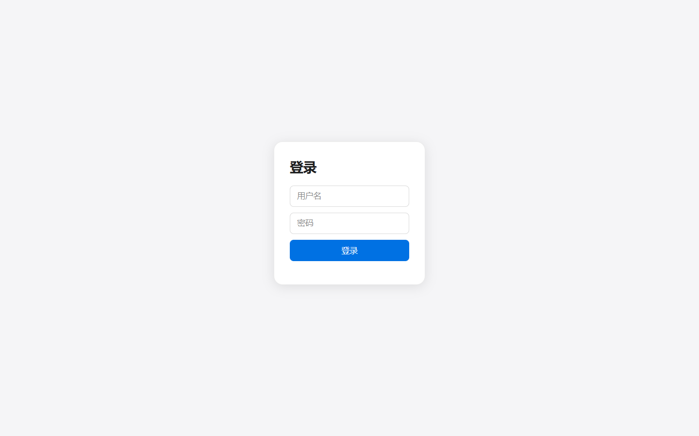
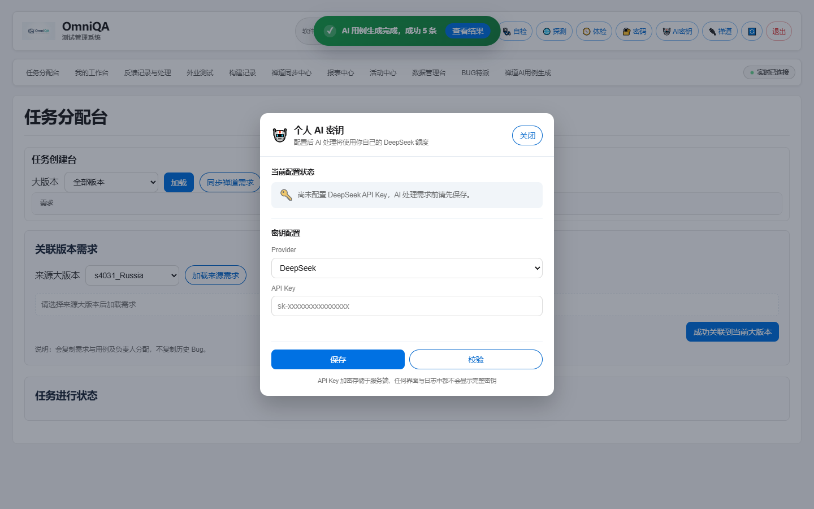
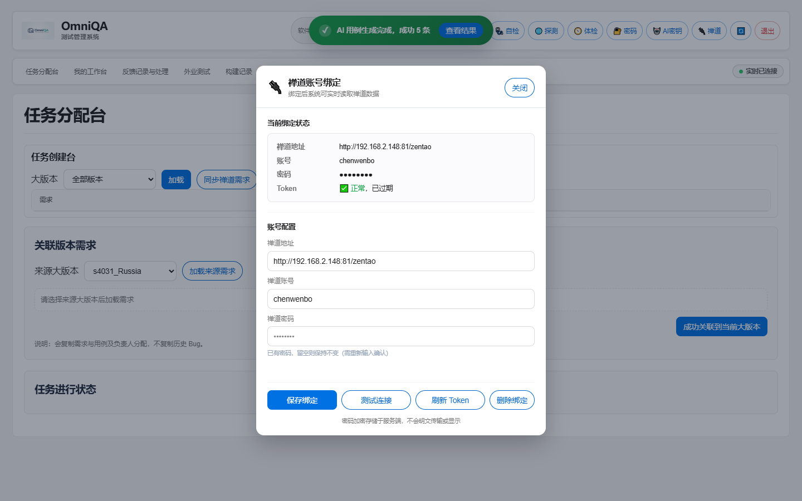
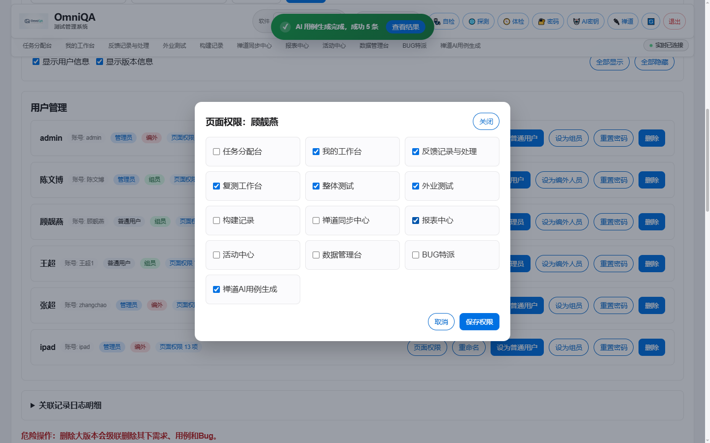
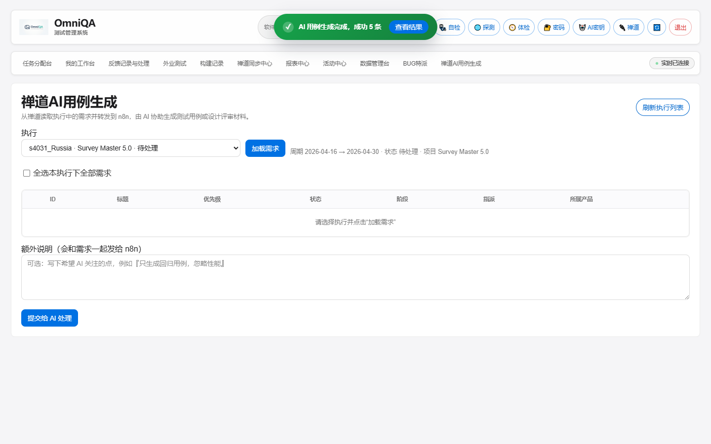
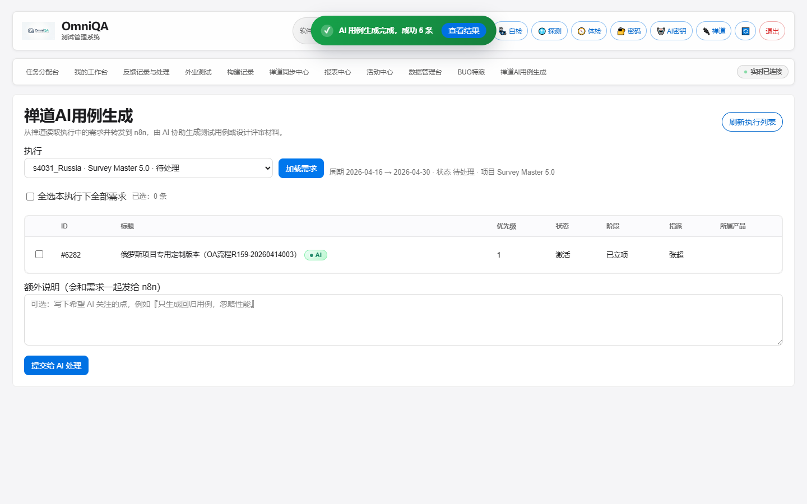
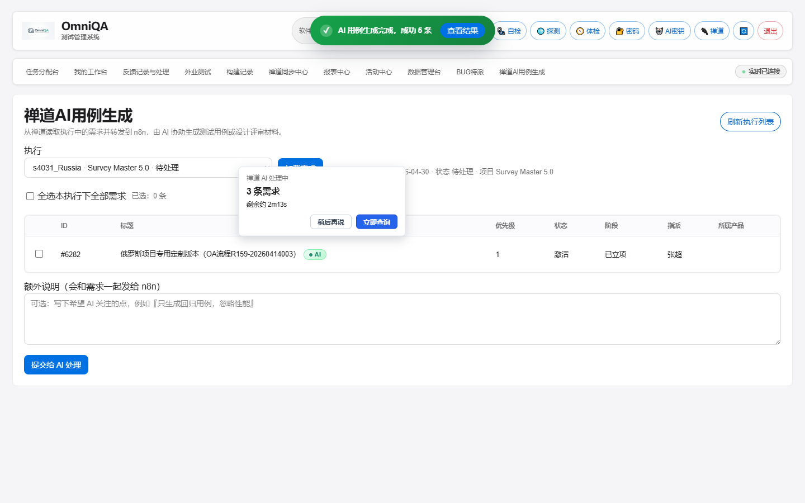
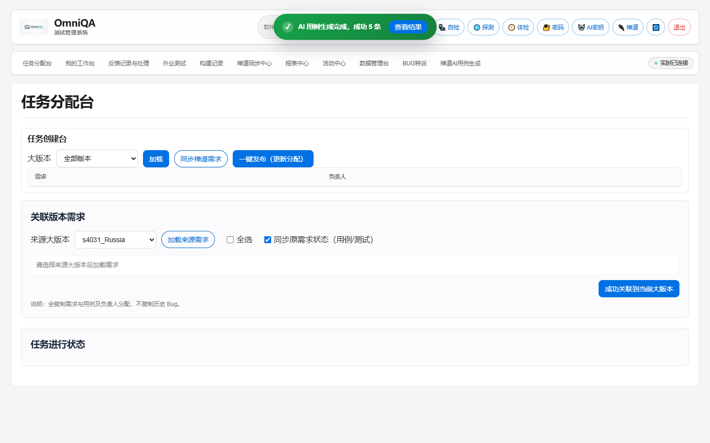
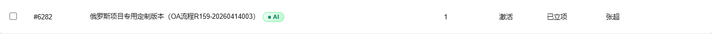
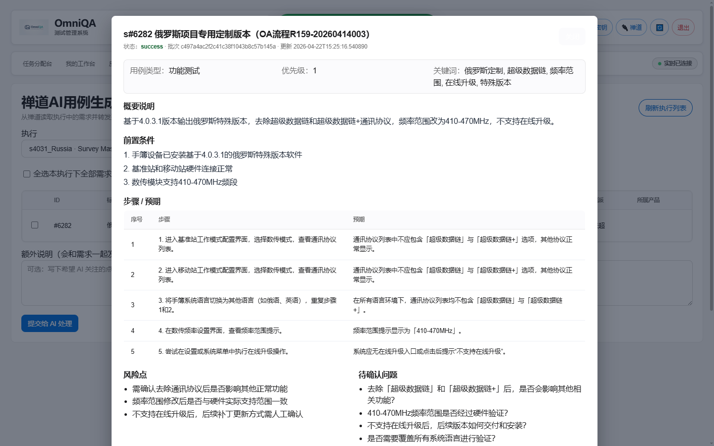

# 禅道 AI 用例生成 · 使用说明

> 适用版本：OmniQA v0.4.0 及以上
> 文档日期：2026-04-23

本说明覆盖 **OmniQA 测试管理系统**中「禅道 AI 用例生成」功能的全部使用流程。
按照本文档操作，可在 5 分钟内完成首次配置并提交一次 AI 生成任务。

---

## 1. 功能简介

「禅道 AI 用例生成」会从禅道项目中读取**执行（Execution）下的需求（Story）**，把需求详情打包发送到 n8n 工作流，由 n8n 调用 **DeepSeek** 等大模型生成测试用例草稿、风险点、待确认问题、可直接粘贴到禅道的用例模板等内容，结果会持久化到 OmniQA 数据库，并通过 SSE 实时推送到前端。

**核心特性：**

- 后台异步处理（提交后可关闭页面、切换 Tab，不阻塞操作）
- 完成后顶部 Toast 高亮提示
- 失败可重试，结果按需求维度长期保留
- **每个用户使用自己的 DeepSeek API Key 计费，互不影响**

---

## 2. 前置条件

完成下面三步后，普通用户就可以开始使用了。

| # | 操作 | 由谁完成 | 一次性 / 每用户 |
|---|---|---|---|
| ① | 服务端配置 n8n Webhook | 运维 / 管理员 | 一次性 |
| ② | 给用户开「禅道 AI 用例生成」Tab 权限 | 管理员 | 每用户一次 |
| ③ | 用户绑定禅道账号 | 用户本人 | 每用户一次 |
| ④ | 用户填入个人 DeepSeek API Key | 用户本人 | 每用户一次 |

> ⚠️ 没有 ④（API Key），提交时会被服务端拦截：
> `请先在个人设置中配置 DeepSeek API Key（点击顶部"🤖 AI密钥"）`

---

## 3. 登录

打开 `http://<服务器IP>:8000/dashboard`，进入登录页：



输入用户名 / 密码后回车，登录成功后进入主界面。

---

## 4. 顶部按钮区（个人设置入口）

登录后右上角的橙色按钮区是个人设置入口，本功能用到的有 **🤖 AI密钥** 与 **🔌 禅道**：


---

## 5. 配置 DeepSeek API Key（每个用户必须做一次）

点击顶部 **🤖 AI密钥** 按钮，弹出"个人 AI 密钥"窗口：



**操作步骤：**

1. **Provider** 保持默认 `DeepSeek`
2. **API Key** 输入框中粘贴你在 [DeepSeek 控制台](https://platform.deepseek.com/api_keys) 申请的密钥，例如 `sk-xxxxxxxxxxxxxxxx`
3. 点击 **保存**
4. （可选）点击 **校验**，系统会向 DeepSeek 发起一次试探性请求，确认密钥有效

**安全说明：**
- API Key 在服务端使用 Fernet 加密存储，**任何界面与日志中都不会显示完整密钥**
- 后续所有 AI 请求都按你自己的额度计费，不会消耗他人配额

---

## 6. 绑定禅道账号（每个用户必须做一次）

点击顶部 **🔌 禅道** 按钮：



**操作步骤：**

1. **禅道地址**：保持默认或填写你公司的禅道地址（含 `/zentao` 路径），例如 `http://192.168.2.148:81/zentao`
2. **禅道账号 / 密码**：填入你的禅道登录凭证
3. 点击 **保存绑定**
4. 点击 **测试连接** 验证凭证有效；如果显示 Token 已过期，点 **刷新 Token**

> 系统会代你登录禅道获取 Token，后续读取需求详情时使用这个 Token。
> 密码加密存储于服务端，不会明文显示或传输。

---

## 7. 管理员授予 Tab 权限

> 这一步**只有管理员**能操作。普通用户如果在导航栏看不到「禅道 AI 用例生成」，请联系管理员授权。

**路径：** `数据管理台 → 用户管理 → 选中用户 → 点击「页面权限」`



勾选最后一项 **「禅道AI用例生成」**，点击 **保存权限**。该用户下次刷新页面后即可看到对应 Tab。

---

## 8. 提交 AI 生成任务

进入顶部导航栏的 **「禅道AI用例生成」** Tab，初始页面如下：



**操作步骤：**

### 8.1 选择执行 + 加载需求

1. 在「执行」下拉框中选择目标禅道执行，例如 `s4031_Russia · Survey Master 5.0`
2. 点击 **加载需求**

需求列表会从禅道实时拉取并展示：



> 标题后面的绿色 ●AI 胶囊代表该需求**已经有过一份 AI 结果**，点击可直接查看。
> 没有胶囊的需求表示尚未跑过 AI。

### 8.2 选择需求

两种方式：

- **逐条勾选**：在每行第一列的复选框中点击
- **全选本执行**：点列表上方的「全选本执行下全部需求」

「已选：N 条」会实时统计。

### 8.3 （可选）填写额外说明

在「额外说明」文本框写下希望 AI 关注的方向，例如：

```
只生成回归用例，忽略性能；重点覆盖语言切换路径。
```

### 8.4 提交

点击左下角蓝色 **「提交给 AI 处理」** 按钮。提交成功后立即弹出右下角倒计时卡片：



**卡片说明：**

- **剩余约 X分Xs**：基于服务端预估时长（默认 5 分钟）的倒计时
- **稍后再说**：仅在前端关闭卡片，**任务会继续在后台跑**
- **立即查询**：手动查询当前批次状态。AI 通常需要 3–5 分钟才能完成，提前点击大概率会显示 `批次仍在处理：pending N`
- **超时显示**：超过预估时长 60s 后卡片背景变橙，提示"AI 可能仍在处理"

> 💡 提交后即可关闭浏览器或切换到其他 Tab；任务在服务端后台异步运行，
> 完成时通过 SSE 推送 + 兜底轮询（每 20s 一次）双保险通知前端，**绝不会"卡住"**。

---

## 9. 接收完成通知

AI 处理完成时，页面顶部居中位置弹出 **Android 风格 Toast**：



**Toast 颜色含义：**

| 颜色 | 含义 |
|---|---|
| 🟢 绿色 | 全部成功 |
| 🔵 蓝色 | 部分成功部分失败 |
| 🔴 红色 | 全部失败 / n8n 转发异常 |

点击 Toast 上的 **「查看结果」** 按钮直达本批次的第一条结果详情。
Toast 4–6 秒后会自动消失，不影响其他操作。

---

## 10. 查看 AI 结果

每条需求的 AI 结果都会持久化到数据库，可在以下两个地方查看：

### 方式一：从 Toast 直接点「查看结果」

参考第 9 节。

### 方式二：在需求列表中点 ●AI 胶囊

需求标题后面的绿色胶囊：



点击后弹出 AI 结果详情：



**结果包含：**

| 字段 | 说明 |
|---|---|
| 用例类型 / 优先级 / 关键词 | AI 抽取的元数据 |
| 概要说明 | 需求一句话总结 |
| 前置条件 | 用例执行的环境/数据要求 |
| 步骤 / 预期 | 具体操作步骤和对应预期结果（表格形式）|
| 风险点 | AI 识别的潜在风险 |
| 待确认问题 | AI 觉得需求不清的地方，可拿去和需求方对齐 |
| 用例模板 | **可一键复制粘贴到禅道**的用例文本 |

弹窗底部有 **「复制禅道模板」** 按钮，点击后用例文本进入剪贴板，直接粘贴到禅道用例编辑器即可。

---

## 11. 异常与排查

| 现象 | 原因 | 解决 |
|---|---|---|
| 提交时报 `请先在个人设置中配置 DeepSeek API Key` | 当前用户未填 API Key | 第 5 节 |
| 提交时报 `当前用户未配置可用的禅道绑定` | 禅道账号未绑定或 Token 过期 | 第 6 节，必要时点「刷新 Token」 |
| 看不到「禅道 AI 用例生成」Tab | 未获得 Tab 权限 | 联系管理员，第 7 节 |
| Toast 显示"n8n 返回 HTTP xxx" | n8n 工作流异常或 DeepSeek Key 无效 | 先「校验」DeepSeek Key，再联系管理员排查 n8n |
| Toast 显示"n8n 转发超时" | 单次请求超过 5 分钟 | 减少单批次需求数（建议 ≤ 10 条），或重新提交 |
| 倒计时卡片很久不消失 | 浏览器掉线 + SSE 断开 | 系统每 20 秒会主动轮询一次，最多再等 20 秒；或刷新页面（会自动恢复未完成的批次）|
| AI 结果里 `pending` 一直没变 | 批次确实仍在跑（DeepSeek 队列拥堵） | 等一会儿再点「立即查询」 |

---

## 12. 给管理员的备注

- 服务端环境变量需要配置：`APP_N8N_ZENTAO_AI_WEBHOOK_URL`（必填）、`APP_N8N_ZENTAO_AI_WEBHOOK_TOKEN`（可选 Bearer Token）
- 不再支持 `APP_ZENTAO_AI_ALLOWED_USERNAMES` 白名单 —— 访问控制完全交由 Tab 权限 + 用户自带 Key 二者控制
- 倒计时预估时长可通过 `APP_ZENTAO_AI_EXPECTED_DURATION_SECONDS`（秒，默认 300）调整
- 单进程部署下 SSE 即时通知；多 worker 部署需要把 SSE 换成 Redis 等共享 bus

---

## 13. 快速上手 Checklist

```
管理员一次性：
  □ 配置 APP_N8N_ZENTAO_AI_WEBHOOK_URL
  □ 给目标用户勾上「禅道AI用例生成」Tab 权限

每个使用者首次：
  □ 顶部「🔌 禅道」绑定自己的禅道账号 → 测试连接
  □ 顶部「🤖 AI密钥」填入 DeepSeek API Key → 校验

日常使用：
  □ 进入「禅道AI用例生成」Tab
  □ 选执行 → 加载需求 → 勾选需求 → （可选）填说明
  □ 点「提交给 AI 处理」
  □ 等待顶部 Toast 提示完成
  □ 点 ●AI 胶囊或 Toast「查看结果」浏览生成的用例
  □ 在结果弹窗「复制禅道模板」→ 粘贴到禅道
```

—— 完 ——
